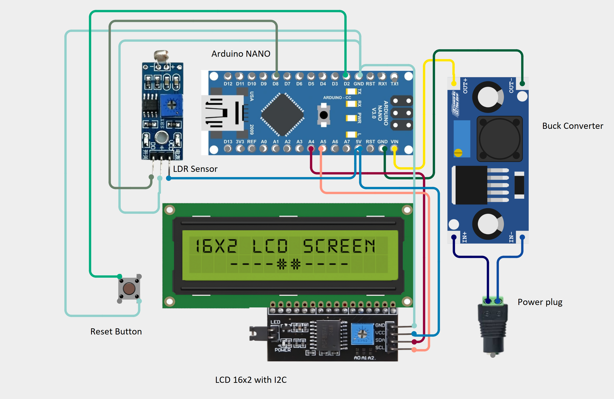
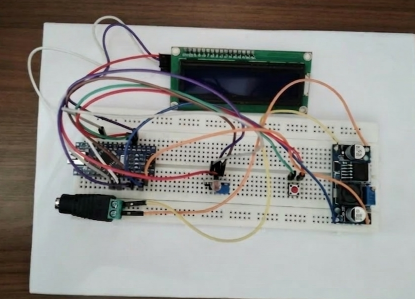
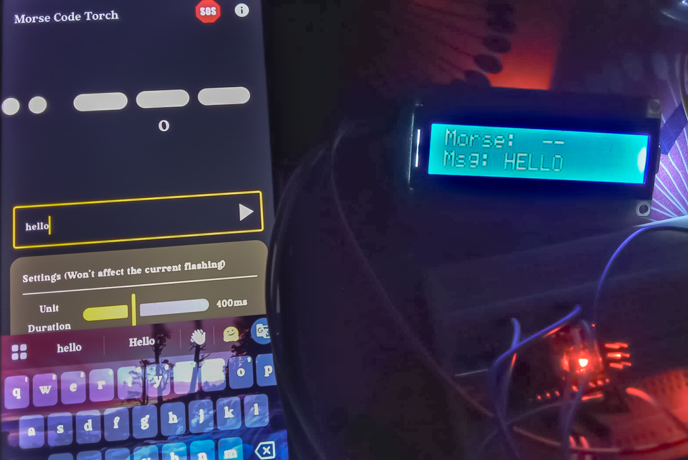

# 💡 LiFi Data Transfer System using Morse Code

## 📌 Overview
This project demonstrates a simple and cost-effective **LiFi (Light Fidelity)** system using visible light for wireless communication.

A smartphone torch with a Morse code app is used as the transmitter, and an LDR sensor with Arduino Nano is used as the receiver to detect and process light signals.

---

## 🎯 Objective
- To demonstrate data transmission using light (LiFi)
- To build a low-cost and simple communication system
- To understand visible light communication using basic components

---

## ⚙️ Components Used
- 📱 Smartphone (Morse Code Torch App)
- 🌞 LDR Sensor Module
- 🔌 Arduino Nano
- 🔋 12V Adapter
- 🔧 Buck Converter (Step-down to 5V)
- 🔘 Reset Button
- 🔌 Breadboard & Connecting Wires

---

## 🧠 Working Principle
1. The Morse code app converts text into light signals (dots & dashes).
2. Smartphone torch transmits light by switching ON and OFF.
3. LDR sensor detects changes in light intensity.
4. Arduino Nano reads LDR values.
5. Signals are interpreted as Morse code and processed.

---

## 🏗️ System Architecture

### 🔹 Transmitter
- Smartphone torch
- Morse code app

### 🔹 Communication Channel
- Visible light (Line-of-sight)

### 🔹 Receiver
- LDR Sensor → Arduino Nano → Output

---

## 💻 Arduino Code

The receiver is implemented using Arduino Nano and LDR sensor.

👉 [View Arduino Code](lifi_reciver.ino)

---

## 📷 Project Images

### 🔌 Circuit Diagram

### 🧪 Prototype Setup

### 📊 Output

---

## ✅ Advantages
- Low cost and easy to build
- No electromagnetic interference
- Secure communication (light cannot pass through walls)
- Good for educational purposes

---

## ⚠️ Limitations
- Requires direct line-of-sight
- Affected by ambient light
- Limited communication range
- Manual Morse code transmission

---

## 🚀 Applications
- Smart home communication
- Hospitals (no RF interference)
- Underwater communication
- Military secure communication
- Educational demonstrations

---

## 🔮 Future Scope
- Automatic Morse code decoding system
- Increase transmission speed
- Noise filtering for accuracy
- Integration with IoT systems
- Long-range LiFi communication

---

## 🧪 How to Run the Project
1. Upload the Arduino code to Arduino Nano
2. Power the circuit using 12V adapter via buck converter
3. Open Serial Monitor
4. Use Morse code torch app on smartphone
5. Point torch towards LDR sensor
6. Observe output

---

## 👨‍💻 Author
**Abishek**  
ECE Student  

---

## ⭐ Acknowledgement
This project is developed as part of academic learning to demonstrate LiFi communication using simple hardware.

---

## 📌 Keywords
LiFi, Arduino Nano, LDR Sensor, Morse Code, Visible Light Communication, VLC, Embedded Systems
